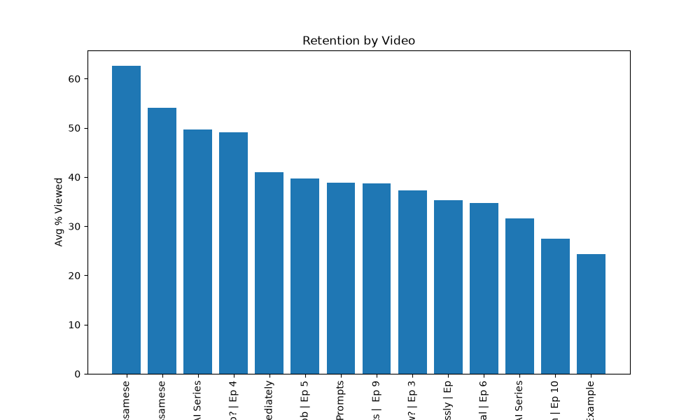

# Channel Analytics Case Study: Understanding What Actually Drives Retention on জিলিকাব লুইতৰে পাৰ

**Tools used:** Microsoft Excel (PivotTables, derived formulas, combo charts) · SQL (SQLite) · Python (pandas, matplotlib)
**Dataset:** YouTube Studio analytics export — 14 videos, 708 total views, 40.18 total watch-time hours

## Background

জিলিকাব লুইতৰে পাৰ is a free, Assamese-language AI literacy YouTube series I created and ran solo across 12 episodes. Rather than analyze a generic public dataset, I used my own channel's real analytics data as a hands-on project to refresh data analysis skills after roughly five years away from active practice — Excel, SQL, and Python.

This write-up documents the analysis, the actual findings, and the specific skills exercised at each stage.

## Methodology

**Stage 1 — Excel.** Raw per-video totals (Views, Watch time, Duration) were exported from YouTube Studio. Two metrics don't come pre-calculated and had to be derived:

- `Avg View Duration (sec) = (Watch time hours × 3600) / Views`
- `Avg % Viewed = Avg View Duration / Duration × 100`

These were built with cell-referenced formulas, then summarized in a PivotTable. One real debugging catch along the way: PivotTables default every numeric field to **Sum**, which is meaningless for a percentage metric — summing 14 individual retention percentages produced a nonsensical 564% "total." Correcting the aggregation to **Average** brought the channel-wide figure to a sensible **40.33%** average retention.

A combo chart (bar = Views, line = Avg % Viewed, on a secondary axis) was then built to visualize the relationship between reach and retention across all 14 videos.

**Stage 2 — SQL.** The same underlying data was loaded into a SQLite database (tables: `videos`, `daily_totals`, `daily_video_views`) and re-analyzed using SQL, cross-validating every result against the Excel figures. This stage covered: `SELECT`/`WHERE`/`ORDER BY`, `GROUP BY` + `SUM()`, `JOIN` across tables on a shared video ID, `HAVING` (filtering on aggregated values), `CASE WHEN` (retention tiering), `RANK() OVER` (window functions), and correlated subqueries (comparing each row against a computed channel average).

**Stage 3 — Python (pandas + matplotlib).** The same raw CSV exports were loaded directly into pandas DataFrames and reprocessed independently of Excel and SQL, as a third cross-check. This stage covered: filtering out non-video summary rows (`df[df['Content'] != 'Total']`), deriving the same retention formula as row-wise column operations, sorting with `.sort_values()`, aggregation with `.groupby()`, and combining tables with `.merge()` (pandas' equivalent of a SQL JOIN — including handling the automatic `_x`/`_y` column-suffix behavior pandas applies when merged tables share a column name). The retention-by-video chart was then rebuilt from scratch in matplotlib and exported as a standalone image file, rather than a screenshot from Excel — a small but real difference, since a script-generated chart can be regenerated automatically the next time new analytics data is exported.

Every number produced in this stage matched Excel and SQL exactly, providing a third independent confirmation of the findings below.

```python
daily = pd.read_csv("Chart data.csv")
totals = daily.groupby('Video title')['Views'].sum().sort_values(ascending=False)
daily_totals_df = totals.reset_index()
merged = daily_totals_df.merge(df, on='Video title')
print(merged[['Video title', 'Views_x', 'Duration']])
```

**A note on AI-assisted workflow.** This entire project — the SQL and Python code included above — was written and debugged by hand, using an AI assistant as an active coding coach: writing each query/script myself, running it, and working through the actual errors returned (clause ordering, mismatched parentheses, ambiguous column names, aggregation-type mistakes) with guided explanation rather than having the AI generate finished code. Current freelance-market data (2026) suggests this combination — AI-assisted process with visible human verification and judgment — is specifically the position earning a premium over both purely manual and fully AI-generated work, which is why it's documented here as part of the process rather than left out.

## Key Findings

**1. Views and retention are not correlated — and the gap suggests a discovery problem, not a content problem.**
The channel's three highest-retention videos (49–63% average viewed) are also its three lowest-viewed. Meanwhile, the two most-viewed videos sit at or below the channel's 40% average retention. Strong content exists on the channel but isn't reliably reaching the audience most likely to watch it through — a discovery/promotion issue rather than a quality issue.

```sql
SELECT video_title, views,
  ROUND(watch_time_hours * 3600 / views / duration_sec * 100, 2) AS avg_pct_viewed,
  CASE
    WHEN watch_time_hours * 3600 / views / duration_sec * 100 >= 45 THEN 'Strong'
    WHEN watch_time_hours * 3600 / views / duration_sec * 100 >= 30 THEN 'Average'
    ELSE 'Weak'
  END AS retention_tier
FROM videos
ORDER BY avg_pct_viewed DESC;
```

**2. One video breaks the pattern — and it's the channel's best all-around performer.**
"Earn From Home" (Episode 7) is the only video that is simultaneously above-average on both views (171, 2nd highest) and watch time (7.84 hrs, 2nd highest), and lands in the "Average-to-Strong" retention band. It's the clearest evidence on the channel that high reach and high engagement aren't mutually exclusive — worth studying why it worked (topic, thumbnail, pacing) and applying those lessons elsewhere.

**3. A video's length materially affects total watch time, independent of popularity.**
Using a subquery to isolate videos with above-average total watch time surfaced a video (Episode 3) that is *not* above-average in views, but qualifies purely because it's the channel's longest video (17.5 minutes). This is a reminder that `watch_time_hours` conflates reach and video length — `avg_pct_viewed` is the more honest retention metric.

```sql
SELECT video_title, watch_time_hours
FROM videos
WHERE watch_time_hours > (SELECT AVG(watch_time_hours) FROM videos)
ORDER BY watch_time_hours DESC;
```

**4. Daily view trends are event-driven, not random — and each release is generating a smaller lift than the last.**
Plotting 28 days of channel-wide daily views (a plain Excel line chart) revealed a clear repeating spike pattern roughly every 4–5 days, consistent with new-episode releases, rather than smooth or random fluctuation. Notably, the size of each spike shrank across the window — the first peak reached ~37 daily views, the last only ~22 — suggesting each new release is drawing a smaller audience bump than the one before it. Worth investigating against subscriber growth and release cadence.

**5. A single low-view video can outrank several higher-view videos once ranked by a different metric.**
Using `RANK() OVER (ORDER BY watch_time_hours DESC)`, a video with only 6 total views ("The Story – Mission") ranked 10th out of 14 by total watch time — ahead of two videos with nearly double its view count. Ranking by the wrong metric can hide which content is actually earning genuine engagement.

## Skills Demonstrated

| Area | Specific skills |
|---|---|
| Excel | PivotTables, derived-metric formulas, aggregation-type correction (Sum vs. Average), dual-axis combo charts, time-series line charts |
| SQL | SELECT/WHERE/ORDER BY, GROUP BY + aggregate functions, multi-table JOIN, HAVING, CASE WHEN, window functions (RANK), correlated subqueries |
| Python | pandas DataFrames, row-wise derived columns, `.groupby()` aggregation, `.merge()` joins, chart generation and export with matplotlib |
| Analysis | Cross-tool validation across Excel, SQL, and Python (three independent confirmations of every figure), metric design, pattern identification, translating results into plain-language business findings |
| AI-assisted workflow | Writing and debugging original code with AI-guided feedback rather than AI-generated output — verified, not delegated |

## Chart



## Next Steps

Extend the Python analysis further — weighted averages, day-of-week release-timing analysis, correlation testing between thumbnail changes and click-through rate — and build a lightweight script that regenerates this whole report automatically whenever new analytics data is exported.

---
*This project was completed as a hands-on skills refresh after a multi-year gap from active data analysis work — documented here as evidence that a structured, practical relearning approach works at any stage of a career.*
